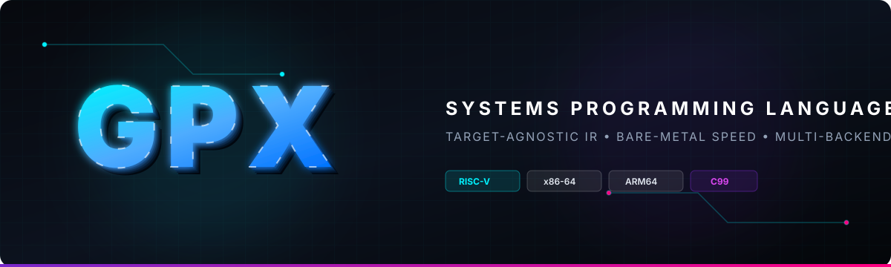

<p align="center">
  
</p>

<p align="center">
  <a href="https://github.com/nishit0072e/gpx-lang/releases"></a>
  <a href="LICENSE"></a>
  
  
  
  <a href="https://github.com/nishit0072e"></a>
</p>

---

## Overview

**GPX** is a modern, statically-typed systems programming language combining high-level syntactic clarity with bare-metal speed and predictability. 

Engineered with a **target-agnostic Three-Address Code (TAC) intermediate representation**, GPX compiles effortlessly to native desktop binaries (**x86-64**, **ARM64**), embedded silicon (**RISC-V RV32I**), WebAssembly, and portable ANSI **C99**.

### Core Highlights
* ⚡ **Zero-Overhead Runtime:** No garbage collection pauses, no hidden runtimes, and instant cold startups (~1ms).
* 🛡️ **Strict Static Safety:** Compile-time type checking, lexical block scoping, and explicit type annotations.
* 🧠 **Middle-End Optimization Engine:** Constant folding, algebraic simplification identities ($x \times 0 \rightarrow 0, x + 0 \rightarrow x$), and dead-code elimination (DCE).
* ⚙️ **Pluggable Backends:** Generates optimized C99 (leveraging GCC `-O2` optimizations) and bare-metal RISC-V RV32I assembly.
* 📦 **Tiny Footprint:** Produces compact standalone binaries (~40 KB) without bloated runtimes.

---

## Architecture Pipeline

```
              GPX Source Code (*.gpx)
                      │
                      ▼
              ┌───────────────┐
              │     Lexer     │  characters -> tokens
              └───────┬───────┘
                      │
                      ▼
              ┌───────────────┐
              │    Parser     │  tokens -> AST
              └───────┬───────┘
                      │
                      ▼
              ┌───────────────┐
              │   Semantic    │  type checking, scopes, symbol table
              │   Analysis    │
              └───────┬───────┘
                      │
                      ▼
              ┌───────────────┐
              │  Target-Free  │  3-address code intermediate representation
              │      IR       │
              └───────┬───────┘
                      │
                      ▼
              ┌───────────────┐
              │ Optimization  │  constant folding, algebraic simplification, DCE
              └───────┬───────┘
                      │
      ┌───────────────┼───────────────┬───────────────┬───────────────┐
      ▼               ▼               ▼               ▼               ▼
┌───────────┐   ┌───────────┐   ┌───────────┐   ┌───────────┐   ┌───────────┐
│  x86-64   │   │   ARM64   │   │  RISC-V   │   │WebAssembly│   │ C99 Emitter
│  Backend  │   │  Backend  │   │  Backend  │   │  Backend  │   │(Universal)│
└─────┬─────┘   └─────┬─────┘   └─────┬─────┘   └─────┬─────┘   └─────┬─────┘
      ▼               ▼               ▼               ▼               ▼
 Windows/Linux    Apple/Mobile     Embedded/      Web Browser/       Any C
   Binaries         Binaries         FPGA           Cloudflare      Compiler
```

---

## Installation & Getting Started

### Option 1: Standalone Binary (Recommended)
Download the pre-compiled standalone `gpx.exe` binary directly from the [GitHub Releases](https://github.com/nishit0072e/gpx-lang/releases) page:
1. Download **`gpx.exe`**.
2. Add the directory containing `gpx.exe` to your system `PATH`.
3. Verify installation:
   ```bash
   gpx --help
   ```

### Option 2: Universal Wheel Package
For machines with Python 3.10+:
```bash
pip install https://github.com/nishit0072e/gpx-lang/releases/download/v0.1.0/gpx_compiler-0.1.0-py3-none-any.whl
```

---

## Compiler CLI Usage

```bash
# 1. Run program directly in the VM (instant execution, zero binary created)
gpx examples/03_fibonacci.gpx --run

# 2. Compile to a Native Windows Executable (.exe)
gpx examples/03_fibonacci.gpx -o fib.exe
.\fib.exe

# 3. Compile to Executable AND preserve intermediate C code
gpx examples/03_fibonacci.gpx -o fib.exe --save-c

# 4. End-to-end Pipeline Diagnostics & Stage Inspection
gpx examples/03_fibonacci.gpx --inspect

# 5. Emit Bare-Metal RISC-V RV32I Assembly
gpx examples/03_fibonacci.gpx --target riscv --emit

# 6. Type Check without Compiling
gpx examples/03_fibonacci.gpx --check

# 7. View Intermediate Representation (TAC) with Optimizations
gpx examples/01_arithmetic.gpx --ir --opt
```

---

## Repository Structure

```
gpx-lang/
├── assets/
│   └── gpx-logo.svg           # Custom 3D text branding banner
├── docs/
│   ├── language-spec.md       # Formal EBNF grammar, types & memory model
│   ├── cli-guide.md           # CLI commands, flags, and testing guide
│   └── language-comparison.md # Performance & architecture vs C, Rust, Go, Zig
├── examples/
│   ├── 01_arithmetic.gpx      # Arithmetic and variable expressions
│   ├── 02_control_flow.gpx    # Conditionals (if/else) and while loops
│   └── 03_fibonacci.gpx       # Functions and recursion
├── LICENSE                    # Proprietary copyright license
└── README.md                  # Quickstart & documentation
```

---

## Documentation

* 📖 [`docs/language-spec.md`](docs/language-spec.md): Complete EBNF grammar, types, scoping rules, and memory model.
* 🛠️ [`docs/cli-guide.md`](docs/cli-guide.md): Complete CLI reference, testing, debugging (`--inspect`), and code generation guide.
* ⚖️ [`docs/language-comparison.md`](docs/language-comparison.md): Comprehensive analysis comparing GPX against C, Rust, Go, and Zig across speed, memory, and scaling.

---

## Ownership & Intellectual Property

**Copyright (c) 2026 Nishit. All rights reserved.**  
All language design, specifications, architecture, and implementations are the proprietary intellectual property of the author. See [`LICENSE`](LICENSE) for terms.
